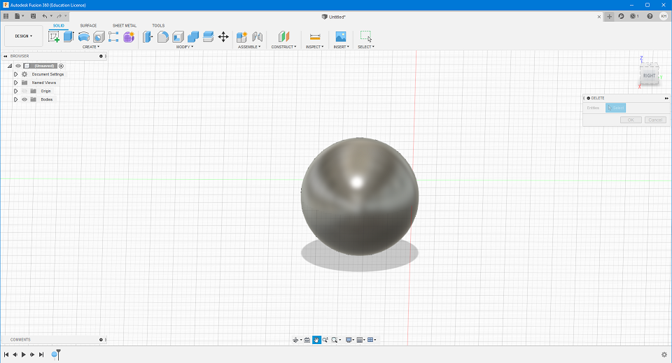
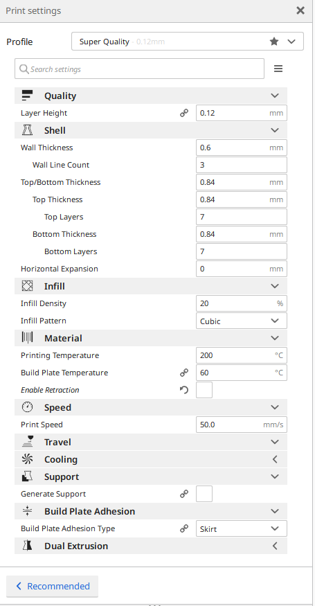
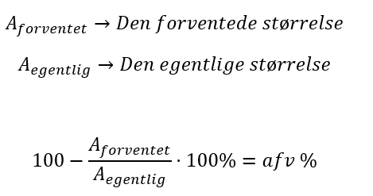
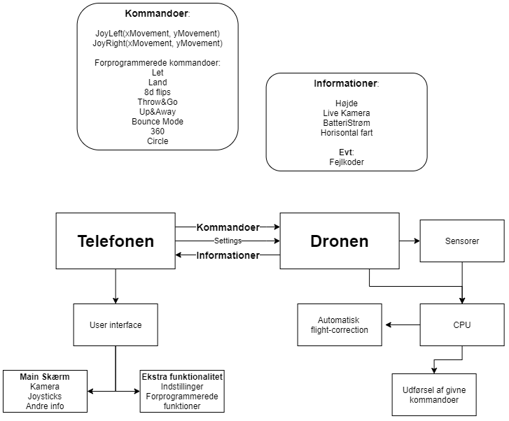
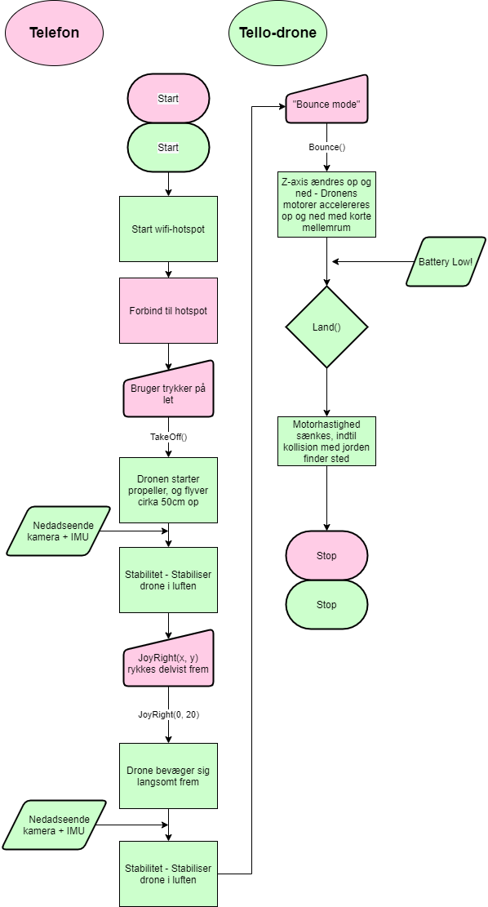
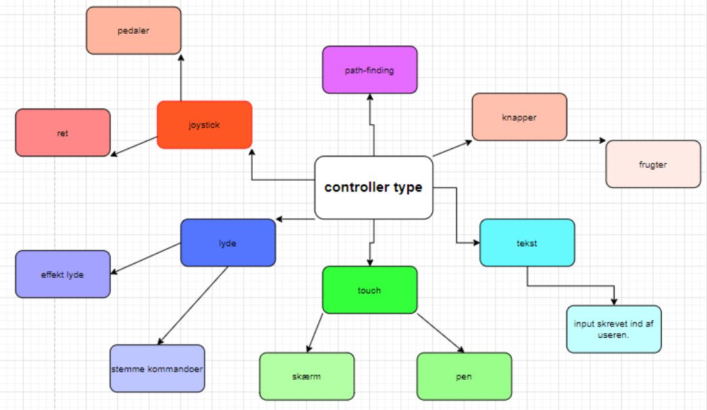
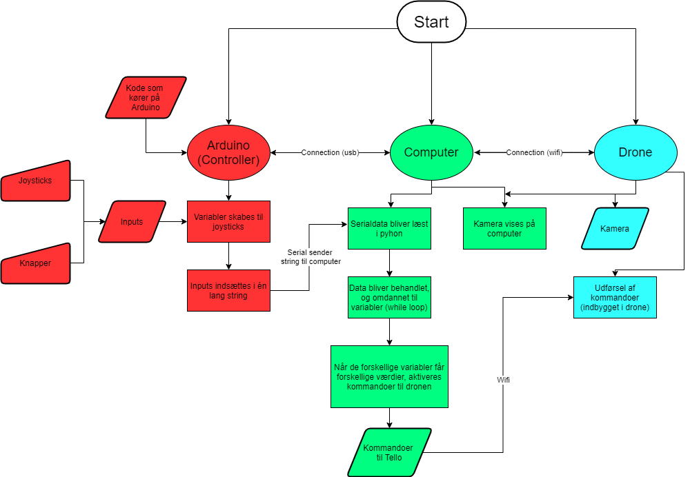
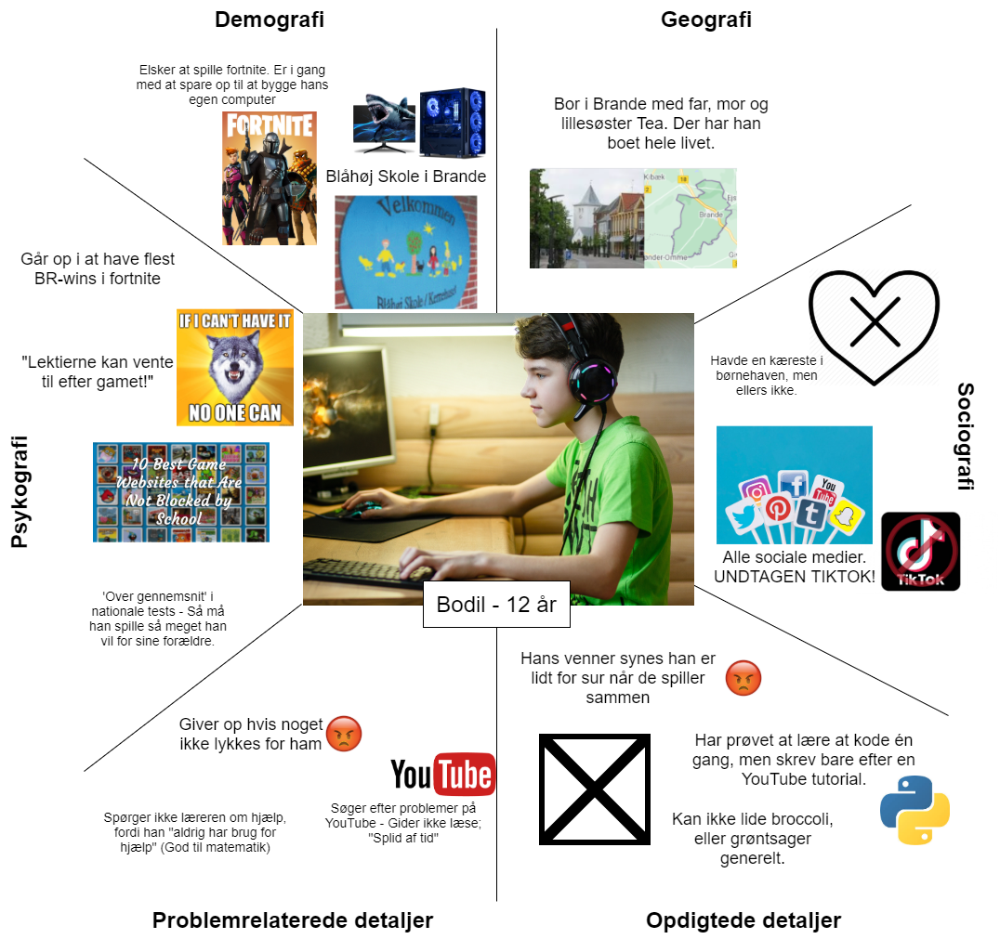
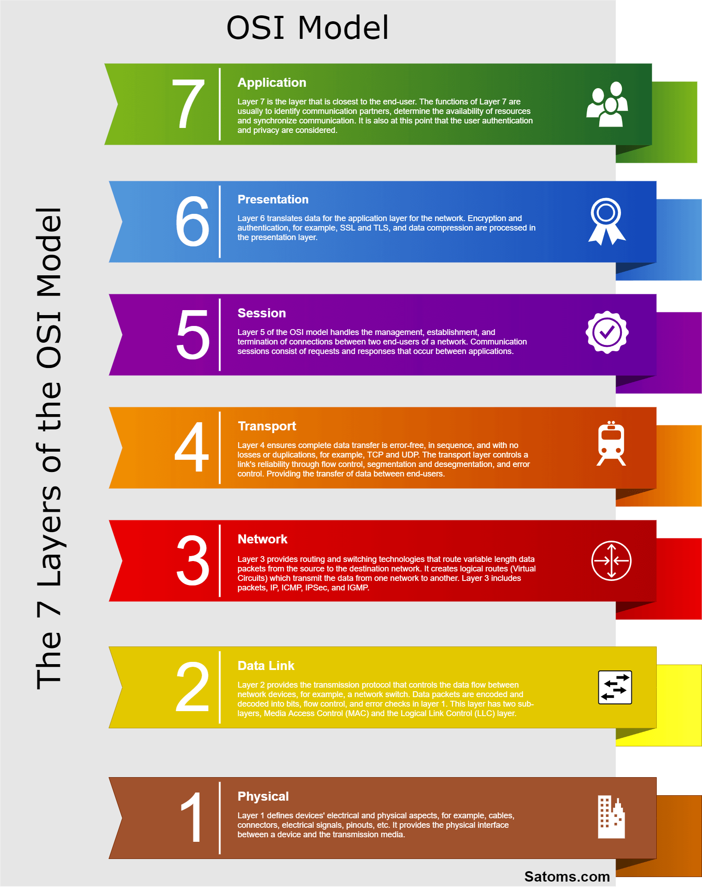

# **Logbog-Informatik**
#### Indholdsfortegnelse:
  1. [Makeraktiviteter](#makeraktiviteter)
      * [3D-print af geometriske figurer](#3d-print-af-geometriske-figurer)
  2. [Systemdesign](#systemdesign)
      * [Analyse af Tello-dronen som IT-system](#analyse-af-tello-dronen-som-it-system)
  3. [Sikkerhed og Privatliv](#sikkerhed-og-privatliv)
      * [Sikkerhed og privacy](#sikkerhed-og-privacy)
      * [Password-sikkerhed](#password-sikkerhed)
      * [HTTP vs HTTPS](#http-vs-https)
      * [Privacy, crypto og VPN](#privacy-crypto-og-vpn)
      * [John Snowden](#john-snowden)
      * [Personlige data og sociale medier](#personlige-data-og-sociale-medier)
  4. [Programmering](#programmering)
      * [Python](#python)
      * [Arduino (C++)](#arduino-c)
  5. [Projekt Dronecontroller](#projekt-dronecontroller)
      * [Iteration 0](#iteration-0)
      * [Iteration 1](#iteration-1)
      * [Heuristikker og gestaltlovene](#heuristikker-og-gestaltlovene)
      * [Design af brugerundersøgelse](#design-af-brugerundersøgelse)
      * [Iteration 1.5](#iteration-15)
      * [Resultater af brugerundersøgelse](#resultater-af-brugerundersøgelse)
      * [Iteration 2](#iteration-2)
  6. [Logbog (Markdown)](#logbog)
      * [Markdown](#markdown)
  7. [Formidling af programmering](#formidling-af-programmering)
      * [Målgruppeanalyse](#målgruppeanalyse)
      * [Reklame integreret i spil](#reklame-integreret-i-spil)
  8. [Webtek](#webtek)
      * [Linux-terminal på windows (SSH aka secure shell nøglegenerering (og installation af WSL på windows))](#linux-terminal-på-windows-ssh-aka-secure-shell-nøglegenerering-og-installation-af-wsl-på-windows)
      * [Curl](#curl)
      * [WSL-kommandoer](#wsl-kommandoer)
      * [OSI-model](#osi-model)
      * [nmap og firewall](#nmap-og-firewall)
      * [nginx](#nginx)
      * [EFF.org og Certbot](#efforg-og-certbot)
      * [PHP](#php)
      * [MariaDB database](#mariadb-database)
      * [Minecraft server](#minecraft-server)
  9. [Databaser](#databaser)
      * [E/R-diagrammer](#er-diagrammer)
      * [WSL-kommandoer](#wsl-kommandoer-1)
  10. <a href="https://youtu.be/dQw4w9WgXcQ?t=43" target="_blank" rel="noopener noreferrer">NGGYU</a> 
      <!--Herover ville normalt åbne linket i ny tab, men understøttes ikke af github. (Normal HTML) -->
     
 
## Makeraktiviteter
### 3D-print af geometriske figurer

  * Vi fik til opgave at fremstille forskellige geometriske figurer, og printe dem på skolens 3D-printere. Herunder ses en guide de forskellige trin i processen, som er at 3D-printe. [Læs hele dokumentationen her](https://github.com/froemosen/Logbog-Informatik/blob/main/3d-figurer%20-%20Kristian%20H.pdf)

  * #### **_Skabning af 3D-modeller (Fusion 360)_**
    * I Fusion 360 kan man konstruere forskellige 3D-modeller og derefter eksportere dem til blandt andet ".stl"- filer som kan bruges i Cura til at printe ens figurer. Programmet viser også mål på alle figurerne, hvilket gør det let og overskuligt at lave sine figurer i de rigtige størrelser.                    
    **Funktionerne som kan bruges er mange, men her er nogle af dem:**
      1. Oprette forskellige figurer (Box, cylinder, kugle, torus, rør, mm.)
      2. Ekstruder og sammentræk ud fra markeringer på figur
      3. Afrunde kanter
      4. Udhule på forskellig vis
      5. Sammensætte figurer
      6. Standard formattering (Flyt, skalér, rotér, osv)
      
         **_Som sagt er der mange flere funktioner i Fusion 360, men der var nogle af dem._** 

    * Screenshot fra Autodesk Fusion 360:
    
    
    
      
    
  * #### **_Slicing (Indstillinger i Cura)_**
    * Ultimaker Cura kan tage 3D-modeller og omdanne dem til ".gcode"-filer, som er kommandoer som en 3D-printer kan forstå. Det fungerer ret enkelt, ved at give lange lister med specifikke kommandoer til printeren om, hvor den skal placere sig over tid, samt en lang række indstillinger. Hele processen som man skal foretage sig i Cura kan beskrives som:
      
      1. Vælg printer
      2. Indsæt fil (.stl, .3mf, .amf, .obj, mm.)
      3. Vælg indstillinger
      4. Slice
      5. Eksporter og print
      
    * Her ses et billede med indstillingerne som kan ændres i Cura:
    
      
  * #### **_Udregning af afvigelse på mål_**
    * Man kan bruge følgende formel for at udregne afvigelsen på diverse størrelser på et 3D-print:
    
    
    

## Systemdesign
  ### Analyse af Tello-dronen som IT-system
  * Vi fik til opgave at analyse Tello-dronen som et IT-system, ved at benytte nye tillærte analysemetoder. Analysen skulle senere bruges som base til selv at konstruere en dronecontroller. Disse metoder, og deres sammenhæng med tellodronen ses i følgende afsnit. Generelt fandt vi ud af at systemet bestod af to grundlæggende bestanddele. Selve dronen og telefonen der styrer den. [Læs hele dokumentationen her](https://github.com/froemosen/Logbog-Informatik/blob/main/Analyse%20af%20Tello-drone.pdf)
  
  * #### **_Blokdiagram over systemets bestanddele_**
    * Herunder ses et boksdiagram som inddeler systemet i de to hovedbestanddele (dronen og telefonen), og angiver hvilke dele der hører til de to.
    
    

    
    
  
  * #### **_Navigation: Analyse af dronens IMU (inertial measurement unit) og nedadseende kamera_**
    * Dronen består primært af to forskellige dele, som den kan bruge til at vide hvor
dens flyvning skal justeres:
      * IMU (inertial measurement unit):
        * _Dronens IMU består af fire forskellige sensorer. Et barometer, et termometer, et gyroskop og et accelerometer. Her er hvad de hver især kan registrere:_
          * _**Barometer** - Højde (Lufttryk)._
          * _**Termometer** - Bruges ved kalibrering, for at kende lufttemperatur._
          * _**Gyroskop** - Dronens rotation på alle akser._
          * _**Accelerometer** - Ændringer i hastighed._
      * Nedadseende kamera:
        * _Dronens **nedadseende kamera** bruges til at registrere både afstand (højde) og fart. Dette kan teknisk set også registreres ud fra barometeret, gyroskopet og accelerometeret, men kameraet fungerer som en slags dobbeltsikring, for at værdierne er korrekte. Derudover kan kameraet også være mere præcis end alternativerne. Kameraet har også en laser, som bruges til at måle højden._

  * #### **_Kommunikaion mellem telefon og drone_**
    * TELLO-dronen bruger wifi til at kommunikere med telefonen. Dette er tydeligt, da
dronen selv opretter et hotspot, som man skal tilslutte sin telefon til. Protokollen der
bliver brugt hedder UDP. 
    * **Sådan virker wifi:**
      * Wifi virker ved at sende data gennem elektromagnestisk stråling, lidt ligesom
radio, tv-signal og gps fungerer. Dog er den primære forskel på disse systemer,
at wifi er lavet til at kunne sende meget mere data ad gangen, hvilket dog
betyder at den data ikke kan udsendes særligt langt. Dette opnås ved at hæve
frekvensen på signalet, hvilket gør at der er flere svingninger i lyset per sekund.
(Derfor ses det for eksempel at 5 GHz internet er hurtigere end 2,4 GHz
internet).
Signalet sender den binære kode ude som systemet har sammensat, og denne
binære kode kan ses enten ved små ændringer i frekvensen, som der bliver
gjort ved fm-radio, eller ændringer i styrken af signalet, som ved am-radio. Dog
er wifi-signaler er en blanding af disse, for at kunne sende op til 8 bits hver
gang der kommer en ny lysbølge, i stedet for kun at sende 1 bit. 

  * #### **_Inddeling af systemet i 3-lagsarkitekturen_**
    * Herunder ses en tabel som inddeler systemet i 3-lagsarkitekturen:
  
  |    |  Dronen  |  Telefonen  |
  |----|----|----|
  |  **Præsentationslaget**  |  - Blinkende LED-indikator  - Sluk-/tænd-knap  |  - Live-kamera **UI:** 1.	Højde og Horisontal hastighed 2.	Settings 3.	Forprogrammerede kommandoer vælges af bruger (Nævnes i ”1.”) 4.	Styring af dronen (joysticks) 5.	Flere funktioner (Optag video, Tag billede)  |
  |  **Logiklaget**  |  - Behandling af input fra telefonen  - Stabilitet fra sensorer  - Send info til telefon  - Information om interne systemer behandles, for at kunne sendes til telefon  |  - Klargør data fra dronen som skal vises til brugeren - Layout af UI - Udsending og fortolkning af brugerinput  |
  |  **Datalaget**  |  - Nedadseende kamera og laser - Input fra telefon **IMU:** 1.	Accelerometer 2.	Termometer 3.	Barometer 4.	Gyrometer - Information om interne systemer (Batteri, osv.) - Kollisions-detektion fra propellerne  |  - Settings **Data fra dronen:** 1.	Fejlkoder 2.	Højde 3.	Batteri 4.	Horisontal hastighed 5.	Kamera-feed  |
  
  * #### **_Flowchart over en simpel mission for dronen_**
    * Herunder ses et flowchart over en simpel mission for dronen:
    
    

    
    

## Sikkerhed og privatliv
### Sikkerhed og privacy
  * **IT-sikkerhed**:
    * Beskyttelse af information (Kreditkortinfo, kodeord, persondata generelt, osv)
    * God IT-sikkerhed findes når det er svært at få uautoriseret adgang til.
    * IT-sikkerhed er både vigtigt på personligt og på større plan (Firmaer, statssystemer, osv.)
    
  * **Fortrolighed, integritet og tilgængelighed:**
    * Fortrolighed:
      * Fortrolighed dækker over at kun de personer og systemer som bør have adgang til systemet har adgang. Altså at ingen kan få uautoriseret agang. 
    * Integritet:
      * Integritet dækker over at brugerere og systemer får de rigtige data, når de anmoder om dem. (F.eks. at man får vist de rigtige beløber i sin bank)
    * Tilgængelighed:
      * Alle den som er autoriserede til at benytte systemet bør have nem adgang til det. Ellers mister systemet relevans.
    * CIA-modellen:
       
       
  
  * **Privacy:**
    * **_Stadig under debat_**
    * Bør man være anonym på nettet?
    * Hvor mange personoplysninger må sider lagre om dets brugere?
    * Må staten få adgang til brugeres privatliv?
    
  * **Brugere og hackere:**
    * Et IT-system er ofte ikke bedre end brugerne på det.
      * Hvis brugere ikke beskytter sig selv ordentligt, er deres kontoer nemmere at få fat i. (Beskytter deres kodeord, vælger gode kodeord, osv.)
    * Usikkerheder i IT-systemer:
      * Menneskelige fejl kan frigive følsomme oplysninger.
      * Password leaks. (Sker oftere end man skulle tro)
    * Hvorfor bliver systemer hacket?
      * Penge (Kreditkortoplysninger mm.)
      * Politiske årsager (For at finde snavs om kandidater mm.)
      * Berømmelse
      * Forskning og udvikling af antivirus-software (Legitimt arbejde for at finde huller i IT-sikkerheden)
  
### Password-sikkerhed
  * **Lastpass eller lignende:**
    * Der findes masser af services som _sikkert_ kan opbevare ens kodeord, hvilket gør at man kan have uendeligt mange autogenerede kodeord, som er ekstremt svære at knække.
    * Når man har forskellige kodeord, er det i værste fald kun én sides kodeord som bliver leaked, hvis at en side skulle komme til at leake brugernes kodeord. Det betyder at man ikke mister nært så meget ved et eventuelt leak. 
  * **Tjek sikkerheden på dit kodeord:**
    * Man kan finde hjemmesider som beregner (i cirkatal) hvor længe det ville tage en normal computer at cracke dit kodeord. Benytter man de langetogenrede kodeord som benytter sig af en masse forskellige typer tegn, når man hurtigt op på enormt lange crackingstider. Dette betyder at det er sværere for hackere at skaffe ens kodeord. 
  * **haveibeenpwned:**
    * På [haveibeenpwned](www.haveibeenpwned.com) kan man se om ens mailadresse har fået kodeord leaked. Dette kan give en idé om man bør ændre sit kodeord. 
  
### HTTP vs HTTPS
  * **HTTP:**
    * HTTP står for Hypertext Transfer Protocol, og er en protokol til at sende informationer mellem bruger og hjemmeside. HTTP kræver intet certifikat for at kunne bruges. 
  * **HTTPS:**
    * HTTPS står for Hypertext Transfer Protocol Secure, og fungerer lidt ligesom HTTP, bortset fra at det er sikkert. Det kræver et CAA-certifikat for en hjemmeside at benytte sig af https, et certifikat som gives ud af en [CA](https://en.wikipedia.org/wiki/Certificate_authority). Dette betyder at ens forbindelse er sikret, og at man kan være mere tryg på HTTPS, end på HTTP. 

### Privacy, crypto og VPN
  * VPN:
    * En VPN (Virtual Private Network) er en service, hvor en bruger kobler sig på en server et sted i verden, og browser igennem den server. Det gør at ens internetudbyder ikke længere kan se hvilke sider man besøger, udover generelt at være mere sikkert fra ondsindede personer på nettet. 

### John Snowden
  * Vi så filmen "Snowden", som filmatiserer hvordan John Snowden afslørede hemmelig masseovervågning af befolkninger verden over, som blev foretaget af blandt andet NSA og CIA. Filmen sætter tanker i gang om privacy, og har også været med til at lave en del af den lovgivning som blandt andet EU er i gang med at indføre, for at sikre borgernes ret til privatliv.  

### Personlige data og sociale medier
  * **Informatikbog - Personlige data:**
    * **_Hvor meget har det offentlige registreret om dig via dit CPR-nummer? Find oplysningerne via borger.dk._**
      * Adresse, flytninger og byggesager
      * Informationer om indkomst og skat
      * Personoplysninger generelt:
        * Tilknyttet A-kasse
        * Navn
        * CPR-nummer
        * Adresse
        * Statsborgerskab
      * Sunhedsdata:
        * Se journal fra sygehus
        * Se dit medicinkort
        * Se laboratoriesvar
        * Gå til organdonation
        * Opret/ret livstestamente
        * Giv fuldmagt til pårørende (e-journal, laboratoriesvar, min log og aftaler)
        * Se konsultationer hos læge, tandlæge, fysioterapeut m.fl.
        * Se oplysninger i Landspatientregistret
        * Se dine vaccinationer
      * Uddannelse (Forkerte oplysninger om ungdomskort)
      * Offentlige ydelser, gæld, mm.
  * **_Hvor mange private virksomheder har registreret oplysninger om dig? Du kan ikke finde et samlet oversigt, så du må prøve at tælle dig frem. Du kan gå ud fra, at du er registreret alle steder, hvor du er fast kunde – forudsat du har opgivet navn og adresse. Mange steder bliver du også registreret, første gang du opgiver navn, adresse eller e-mail. Prøv at lave en optælling._**
    * MANGE! Jeg kan hurtigt finde frem til mindst 20, men jeg kan forestille mig at tallet er meget højere. 
    
    
 * **_Eksempler på persondata kan være race, økonomi, navn, etnisk oprindelse, religion, adresse, fødselsdato, biometriske data, gæld, seksuelle forhold og arbejdsområde. Fordel ovenstående oplysninger i kategorierne almindelige personoplysninger og følsomme personoplysninger._**
   * | Datatype          | Mit bud    | Rigtigt Svar |
     |-------------------|------------|--------------|
     | race              | Følsom     | Følsom       |
     | økonomi           | **Følsom**     | **Almindelig**   |
     | navn              | Almindelig | Almindelig   |
     | etnisk oprindelse | Følsom     | Følsom       |
     | religion          | Følsom     | Følsom       |
     | adresse           | Almindelig | Almindelig   |
     | fødselsdato       | Almindelig | Almindelig   |
     | biometriske data  | Følsom     | Følsom       |
     | gæld              | **Følsom**     | **Almindelig**   |
     | seksuelle forhold | Følsom     | Følsom       |
     | arbejdsområde     | **Følsom**     | **Almindelig**   |

## Programmering
### Python
  * Python er et relativt simpelt programmeringssprog, som ikke er begrænset til én platform. Det er specielt på den måde, at det er lavet til at være "readable", hvilket betyder at der er ændringer på syntaksen i forhold til mange andre programmeringssprog. I python betyder _indents_ noget for hvad bestemte dele af koden tilhører, i stedet for at man skal bruge "{}". Meget specielt er også at man ikke skal deklarere datatyper på sine variabler når man laver dem. En anden fordel ved python er også, at det kører meget hurtigt, og at man ikke skal konstruere sit program i python for at kunne køre det, ligesom i mange andre sprog. 
  
  
    I Informatik har vi brugt python til at kode vores dronecontroller, ved også at benytte tellopy-biblioteket.
### Arduino (C++)
  * En arduino er en lille computer, som man kan bruge til alverdens ting. I Informatik har vi brugt arduinoer til at konstruere vores dronecontroller. Arduinoen kører maskinkode, som konstrueres ud fra c++ sammen med Arduino IDE. I c++ koder man arduinoen, til at frigive den data man gerne vil have. Arduinoen har forskellige porte som kan registrere input, og det er vigtigt at koden registrer de rigtige data. Til sidst i koden til arduinoen udskriver arduinoen data i serial, som derefter kan registreres i python. 

## Projekt Dronecontroller
### Iteration 0
  * Iteration 0 i Projekt Dronecontroller gik primært ud på at planlægge projektets gang. [Læs dokumentationen til iteration 0 her.](https://github.com/froemosen/Logbog-Informatik/blob/main/Informatik%20Controller%20-%20Iteration%200.pdf)
  * #### Brainstorm - Sådan kan man styre en drone
    * Vi lavede en mindmap over forskellige måder hvorpå man kan styre en drone, for at få en idé om hvilke muligheder vi havde til at lave en controller. **Vores brainstorm kan ses herunder:**
    
    
  
  * #### Konkrete idéer til controllerkoncepter
    * Efter brainstormen kom vi op med tre konkrete idéer til koncepter til vores dronecontroller. De tre idéer kan ses herunder: *(Den udvalgte står i fed)*
    
      
      **Konkrete idéer til controllers:**  
      * Accelerometer + Gyroskop føres rundt for at bestemme dronens bevægelse
      * **Klassisk Arkade (joysticks og knapper)**
      * Lyde som bestemmer dronens bevægelse (Forskellige frekvenser = forskellige retninger)
  
  * #### Den udvalgte idé
    * Vi har valgt at lave en arcade-stil controller til vores drone. 
     * Selve controlleren består af joysticks og knapper, som er tilknyttet en arduino.
     * Computeren bliver benyttet både til at oversætte kommandoer fra arduino, og til at vise live video fra dronen.
     * Hele pakken pakkes ind på en måde som skaber samme setup som i en klassisk arkade. 
  
  * #### Faseplanen!
    * Vi lavede en simpel faseplan for projektet, som viste sig at være utroligt værdifuld for overblik i projektet. Vi havde pludselig en simpel måde at se hvilke dele af projektet vi var i gang med, hvilke vi var færdige med, og hvilke der stadig manglede. Det giver overblik over både processen og ens forløb ift. tiden man har tilbage til at blive færdige. **Faseplanen kan ses herunder:**
    
    
      **Tjekliste - Faser til vores controller-byggeri:**
      1. Controller bygges på arduino
      2. Input til PC fra arduino
      3. Oversættelse fra c++ til python
      4. Output fra pc - kommandoer til drone
      5. Drone skal kunne sende video til computer, som skal fremvise det.
      6. Æstetik - Custom Arcade Joysticks, Classic Arcade
      
      _**Extra stuff:**_
      - Fejlfinding
      - Ekstra funktionalitet
  * #### Flowchart over systemet:
    * Flowchartet herunder viser vores første idéer for et flowchart over hele systemet:
    
    
    
  

### Iteration 1
  * Ved udgangen af iteration 1 var projektet ved at tage form. [Læs hele dokumentationen til iteration 1 her.](https://github.com/froemosen/Logbog-Informatik/blob/main/Informatik%20Controller%20-%20Iteration%201.pdf) Følgende punkter i fase planen var påbegyndt eller færdiggjort ved afleveringen af iteration 1:
    * **1. Controller bygges på arduino**
    * **2. Input til PC fra arduino**
    * **3. Oversættelse fra c++ til python**
    * **6. Custom Arcade Joysticks**
    
### Heuristikker og gestaltlovene
  * Gestaltlovene og Jakob Nielsens 10 heuristikker om UI-design er principper (love), som hjælper designeren af et user interface med at gøre det mere brugervenligt. Det gør de gennem psykologiske 'tricks', som gør en programmer mere overskuelige og mere tilegnede til den menneskelige hjerne. Her er hovedpointerne i de 10 heuristiskker og gestaltlovene:
  * [**Gestaltlovene:**](https://informatik-gym.dk/glossary/gestaltlove/)
    * #1: Nærhed (proximity). Figurer der er placeret tæt på hinanden ses som en gruppe.
    * #2: Lighed (similarity invarians). Ens figurer opfattes som en gruppe.
    * #3: Lukkethed (closure). Delelementer af et billede stykkes sammen til at skabe helheden.
    * #4: Kontinuitet og symmetri. Optræder to figurer symmetriske omkring en linje, ses de som en gruppe.
    * #5: Prægnans (Prägnanz) – figur/baggrund. Hjernen leder den efter mønstre, kontinuitet, ensartethed.
    * #6: Erfaring (Past experience, “Common Fate”). Dækker bl.a. over brugen af ikoner
    * #7: Forbundethed – Forbindes figurer med en streg, opfattes de umiddelbart som sammenhørende (forbundenhed er et design tips – ikke en gestaltlov).  
  
  * [**Jakob Nielsens 10 heuristikker**](https://www.nngroup.com/articles/ten-usability-heuristics/)
    * #1: Visning af systemstatus
    * #2: Match mellem system og den rigtige verden
    * #3: Brugerkontrol og frihed
    * #4: Overensstemmelse og standarder
    * #5: Fejlprævention
    * #6: Genkendelse hellere end hukommelse
    * #7: Fleksibilitet og effektiv brug
    * #8: Æstetisk og minimalistisk design
    * #9: Hjælp brugere med at genkende, diagnosere og kommer videre fra fejl.
    * #10: Hjælp og dokumentation
    
### Design af brugerundersøgelse
  * For at kunne optimere vores endelige design, er det vigtigt at man finder svage punkter ved ens design, som skal forbedres. Det vælger vi at adressere ved at lave en brugerundersøgelse, hvor vi får nye brugeres første indtryk af vores dronecontroller. [Læs dokumentationen til design af brugerundersøgelse her](https://github.com/froemosen/Logbog-Informatik/blob/main/Brugerunders%C3%B8gelse%20-%20Dronecontroller.pdf)

### Iteration 1.5
  * Vigtige ting som vi nåede før projektet blev sat på pause i evig tid:
    * Utestet kode til kommunikation mellem drone og PC
    * Video fra drone kan fremvises på PC
    * Den fysiske controller-/arkadeprototype blev fremstillet

### Resultater af brugerundersøgelse
  * **Projekt afsluttet grundet Corona**

### Iteration 2
  * **Projekt afsluttet grundet Corona**

## Logbog
### Markdown
  * Til skrivning af logbogen benytter vi github's readme-dokument, som benytter sig af Markdown-formatet (.md). Markdown er en simplificeret version af HTML, som gør det nemmere at lave simple webbaserede dokumenter. Ud over den syntaks som er lavet specielt til Markdown, for at gøre det simpelt, kan man stadig benytte sig af normal HTML, hvilket gør at det ikke er begrænset, selvom det er simplificeret. 
  
  * [Guide til Markdown](https://guides.github.com/features/mastering-markdown/)

## Formidling af programmering
### Målgruppeanalyse
  * Som en del af et spil vi lavede i programmering, lavede vi i Informatik en målgruppeanalyse. Her undersøgte vi demografi, geografi, psykografi, sociografi og problemrelaterede detaljer. Vi opstillede en fiktionel person (persona), og opsatte karaktertræk indenfor de kategorier. Personaen kan ses herunder:
  
  
  
### Reklame integreret i spil
  * Projekt som beskriver hvordan der kan reklameres for raspberry pi i det fremstillede spil. Herunder blev der kigget på følgende ting:
    * Eksplicitte og implicitte reklamer
    * Produktet vi vil reklamere for (Raspberry Pi)
    * AIDA-modellen

### Dataindsamling fra brugere
  * Projekt hvor det beskrives hvordan man kan lave dataindsamling fra brugere, som kan bruges fordelagtigt ift. reklamer. 

## Webtek
### Linux-terminal på windows (SSH aka secure shell nøglegenerering (og installation af WSL på windows))
  * Begreber som du skal huske:
    * **WSL** (Windows Subsystem for Linux) - Linux-terminalen vi har downloadet
    * **SSH** (Sercure Shell) - Sikker terminal
    * **RSA** (Rivest, Shamir, Adleman) - Kryptosystem baseret på co-prime primtal. Din RSA-key er baseret på dette. Det er bare en sikker måde man kan give adgang til brugere med rigtige nøgler. 
  

  * [Link til opgaven på it's learning](https://aarhustech.itslearning.com/ContentArea/ContentArea.aspx?LocationID=40172&LocationType=1&ElementID=1289790)
  * Min public key er: "ssh-rsa AAAAB3NzaC1yc2EAAAADAQABAAACAQDFdv5ERQCZT/h8C9GAE/bLrmE0k8VnEgmwdYOcRdJnYGoE5sM1BKnDaagw/OcknfCtHy9owDV1T8Ecuv6COwUpgA7FvWJt3NiI3ssZF6NPy0Xcp08YugjlcQvr08/umKVBe8/1FxeS9tIW6ap2KU2Elf7uTUqpL/SVYh7Eff7dpF7iaGdF42kvA07uNFDBTY05cLdfndrNRcha+8RFhnJYgkrXi942wpNOwnEC7/V5WgqKhLMzh4dBgO9d6iiZcZ9en5FVsb2G2ts4MB5EShXX28n7iHS5TS68VLuYBxoaP0q0s/E62ksg9WFWUYlLzOYXE4ht1lBRws3hSi5DGSNdc5BtsvOCKJ6WRHgd3HqhU4b6C8z5YLsyBAogKPBNr3E6BUcYD1mn2rDxU+QS5HauMEy0uSfVuB90UKvju0vlSInuWDfa/xbkGsiCYHFrB1cGvWyxxi4vsc7dT6d7UizvzMrfrEfkH1cmpCfmsFrUkS24wX2N02IU0WojL641tX2HJayAcoNbr6CeLk2FuP2RZPsXSlQqx2iIUMV/XxDQBbr90r27SWLt4yGPcLDFXB8ngkMkNVxdAzXerstgMx34Eby+zR+4fAaIlLx3n5YlWZ+vee4nVo+fF35CsECae4V0fWmlSGYOrG77EhaT1IdVFLvGIVWYe/80NQ8mCN8ckQ== froemosen@LAPTOP-605L94J6"

### Curl
* Curl kan indsamle data fra forskellige webadresser. Det gør ved følende format:
  * *curl (evt. ekstra kommandoer -v) www.domain.com/fil/fil.type*
  * Man kan bruge "-v"-kommandoen til at få ekstra super meget data fra ens request. Derfra kan man se formatet på hvordan man laver server request. Det kan bruges i for eksempel arduino ellers raspberry pi, til at få data fra hjemmeside. 

### Bash
  * Bruges til at skrive kommando ind i fil. Følgende ting man bruges:
    *  command parameter **>** filnavn.filtype (Skriver ind i fil, erstatter½)
    *  command parameter **>>** filnavn.filtype (Skriver ind i fil, uden at overskrive)

### WSL-kommandoer

  - | Kommando | Parametre | Beskrivelse |
    |-------------------|--------------|----------------------------|
    | **cd .ssh** | ingen parametre | Går ind i .ssh-stien |
    | **ls** | -a (viser alt) | Viser filer i mappen |
    | **pwd** | ingen parametre | Viser fil-sti |
    | **curl _url_** | -v (viser flere info) | Henter data fra website |
    | **echo** | ingen parametre | Siger det man skriver tilbage som output. (Brug fx til test af bash) |
    | **cat file.format** | ingen parametre | Viser data fra fil i terminal. Man kan godt printe indhold fra flere filer ad gangen |
    | **dig _url_** | ingen parametre | Skaffer lidt data fra hjemmeside (IP-adresse fx.) |
    | **chmod _permissions_ _filename_** | Ingen parametre | Binære tal viser permissions for skaber, gruppe og alle. Derfor giver 777 alle permissions til alle, mens 000 giver ingen permissions til alle. Tallene udregnes med tre bit, i rækkefølgen Read, Write, Execute. Derfor giver alle permissions til en bestemt bruger 7. Der er tre brugergrupper, så 777 er alle permissions til alle. Makes sense.
    | **nmap _url_** | ingen parametre | Bruges til at se åbne porte på server |
    | **certbot** | idk | bed om certification |
    
### OSI-model
  - OSI-modellen viser kommunikationsstruktur for computere. Man kan også tale om et 8. lag, som ville være brugeren/fejllaget. Her sker der ofte ID10T-fejl. :)
  
  
  
  
### nmap og firewall
  - nmap kan tjekke hvilke porte der er åbne på computere og servere. Man skriver "nmap _serverID_"
  - Husk "sudo apt install nmap" (ubuntu)
  - Eller "sudo yum install nmap (alma)

### nginx
  - Bruges til at installere http og https

### EFF.org og Certbot
  - Bruges til at få godkendelse/certifikat til https. Certbot sender request til EFF.org
    
### PHP
  - Kommunikation mellem HTML-server og database. Henter data fra databasen, og viser det til brugeren.

### MariaDB database
  - Plugin som bruges til at adminstrere sin database. Taler sammen med PHP.

### Minecraft server
  - Til Java-servers bruges **jre**.
  - Til Bedrock-servers bruges **pocketmine**.

## Databaser
  ### E/R-diagrammer
  - E/R-diagrammer bruges til at vise relationer med entiteter, relationer og attributer i en database/et I/T-system. 
  - [Læs om dem her](https://informatik.systime.dk/?id=1136)

  ### WSL-kommandoer

  - | Kommando | Parametre | Beskrivelse |
    |-------------------|--------------|----------------------------|
    | **scp _source_ _login:destination_** | ingen parametre | Kopier filer ind på server med Secure CoPy |

